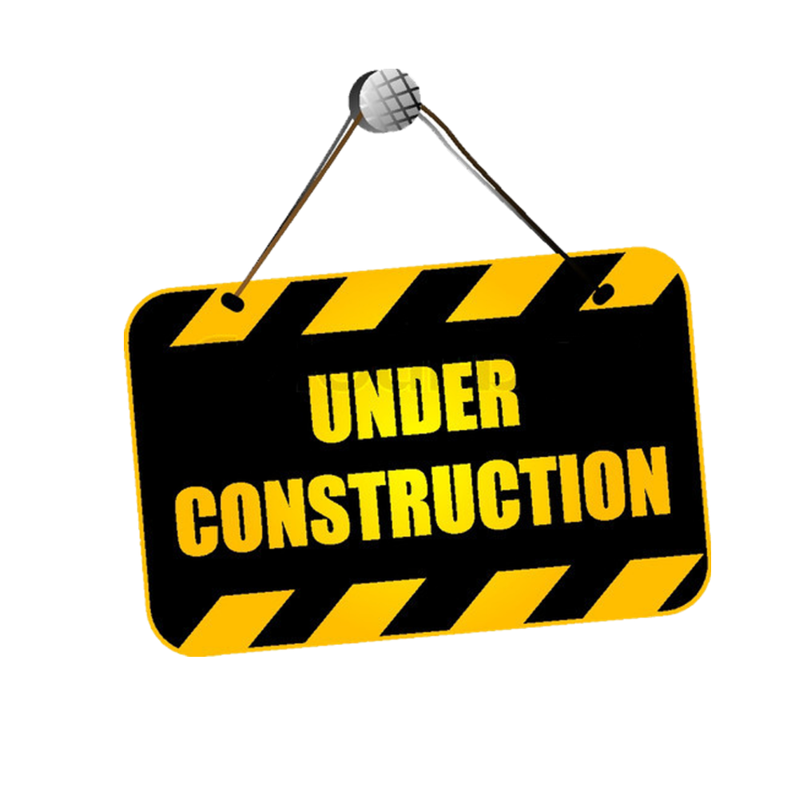

<h1 align="center"> LITMUS 1.0</h1>

    Java-BDD Framework for Web & API Test Automation
     

<!-- TABLE OF CONTENTS -->

  
Contents

  <ol>
    <li>
      <a href="#about-the-project">About The Project</a>
    </li>
    <li>
      <a href="#getting-started">Getting Started</a>
      <ul>
        <li><a href="#folder-structure">Folder Structure</a></li>
        <li><a href="#prerequisites">Prerequisites</a></li>
        <li><a href="#setting-up-a-virtual-environment">Setting up a virtual environment - Optional</a></li>
        <li><a href="#local-development-setup">Local Development Setup</a></li>
      </ul>
    </li>
    <li><a href="#usage">Usage</a>
    <ul>
        <li><a href="#runner-file">Runner File</a></li>
        <li><a href="#yaml-configuration">YAML configuration</a></li>
        <li><a href="#ci-cd-integration">CI/CD integration</a></li>
      </ul>
    </li>
    <li><a href="#reports">Reports</a>
    <ul>
        <li><a href="#robot-reports">Robot Reports</a></li>
        <li><a href="#allure-reports">Allure Reports</a></li>
      </ul>
    </li>
    <li><a href="#reading-material">Reading Material</a>
    <ul>
        <li><a href="#robot-framework-cheatsheets">Robot Framework Cheatsheets</a></li>
      </ul>
    </li>
    <li><a href="#roadmap">Roadmap</a></li>
    <li><a href="#contact">Contact</a></li>
  </ol>

 

## About the project

<h2 align="center">
    
     
    This framework is under construction. Please check back again later.
</h2>

## Contributing

To contribute to this repository, please see the [contribution guidelines](CONTRIBUTING.md).

<!-- reference urls -->

